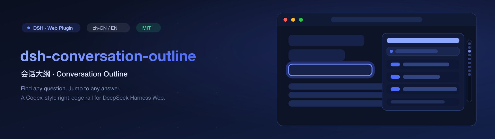

# dsh-conversation-outline



[](https://www.npmjs.com/package/@chestnut23/dsh-conversation-outline)
[](LICENSE)
[](https://nodejs.org/)
[](https://github.com/lzbaclz/dsh-conversation-outline)
[](https://github.com/deepseek-ai/DeepSeek-Harness)

[简体中文](README.zh.md) · [Usage](docs/usage.md) · [Troubleshooting](docs/troubleshooting.md) · [Security](docs/security.md) · [Publishing Guide](docs/publishing-guide.md) · [Design Spec](docs/implementation-spec.md)

**Find any question. Jump to any answer.**

Long agent conversations scroll forever. `dsh-conversation-outline` is a
Codex-style **conversation outline** for [DeepSeek Harness](https://github.com/deepseek-ai/DeepSeek-Harness) Web:
a slim, always-visible **right-edge rail** — one bar per question, like a minimap of the
conversation — that **expands on hover** into a preview panel of every question's opening
words. Click a bar or a row and you are teleported to that message in the Chat view, with
a flash highlight so you cannot miss it. Bilingual zh-CN / en.

## Highlights

- **Right-edge rail (minimap)** — thin, pinned to the right edge, one bar per question in
  chronological order. Out of the way while you read; >60 questions fold into a `+N` marker.
- **Hover to preview** — hover the rail and the panel slides out with each question's
  opening words (single-line truncated), `#turn` badge and `HH:MM` time. Collapses 240 ms
  after you move away; tap-to-pin on touch, `Esc` closes. Pure overlay — your content
  never shifts.
- **Click-to-jump** — switches to the Chat view (even from Trajectory), scrolls to the
  message and flashes it for 1.8 s. Respects `prefers-reduced-motion`.
- **Search & load older** — case-insensitive filtering, plus paging into older history.
- **Live** — new questions appear while the session runs; follows the current session and
  collapses on switch.
- **Zero dependencies at runtime** — the browser bundle imports only React (the platform
  modules); everything else is inlined and purity-checked at build time.

## Install

**Prerequisites**: [DeepSeek Harness](https://github.com/deepseek-ai/DeepSeek-Harness)
(`dsh` available); Node.js `^22.19` or `>=24`; pnpm 10+.
If you run DSH via `npx`, prefix the commands with `npx -p @deepseek-ai/dsh `.

```sh
# 1) GitHub (works right now — recommended)
dsh plugin --profile web add github:lzbaclz/dsh-conversation-outline

# 2) npm (published under our own scope; the unscoped name belongs to an
#    unrelated project — always install the @chestnut23 scope)
dsh plugin --profile web add @chestnut23/dsh-conversation-outline

# 3) from source (local development)
git clone https://github.com/lzbaclz/dsh-conversation-outline.git
cd dsh-conversation-outline
pnpm install && pnpm dev:types && pnpm build
dsh plugin --profile web add "link:$(pwd)"
```

> **Zero build scripts on the GitHub path**: the built `lib/` is committed to this repo
> (`.gitignore` deliberately does not ignore it), so a `github:` install fetches
> ready-to-load artifacts — no `prepare` script, no profile `allowBuilds` configuration.
> **Name warning**: an unrelated project owns the *unscoped* npm name
> `dsh-conversation-outline`. This plugin is only published as
> `@chestnut23/dsh-conversation-outline` — always install the scoped name (or the
> GitHub path above).

**After installing**: restart the DSH Web service and refresh the page (`link:` installs
just need a page refresh after `pnpm build`). Confirm with:

```sh
dsh plugin --profile web list
```

Upgrade with the same `add` command (optionally pin a version:
`@chestnut23/dsh-conversation-outline@0.1.0`).

## Usage

Install, restart, open any session that already has messages — a thin strip appears on
the right edge. Hover it to preview questions, click a bar or a row to jump, search to
filter, `Load older` to page through history. Full walkthrough:
[docs/usage.md](docs/usage.md). Something's not showing up? [Troubleshooting](docs/troubleshooting.md).

## Preview

> Real-screenshot placeholder: after installing, drop a screenshot of the rail + panel
> at `assets/ui.png` and it will appear here.


## Development

```sh
pnpm dev:types   # symlink @deepseek-ai type packages (one-time)
pnpm typecheck   # host + client dual tsc programs
pnpm build       # tsc(host) → tsc(client) → tsdown bundles lib/client.js
pnpm verify      # offline smoke: manifest/exports/patch/bundle shape + pure-logic asserts
```

Client-only changes hot-reload: `pnpm exec tsdown --watch` rewrites `lib/client.js`, and
the DSH client HMR chain (or a plain page refresh) picks it up. Host/manifest changes
need a service restart. Scratch-profile testing recipe:
[docs/implementation-spec.md §4.2](docs/implementation-spec.md).

## Talk to us

Issues are welcome any time: [open one](https://github.com/lzbaclz/dsh-conversation-outline/issues).
Questions, feature ideas, screenshots of what you built with it — all good.

## License

MIT — see [LICENSE](LICENSE). Client-only plugin: no telemetry, no extra network calls
([security notes](docs/security.md)).
